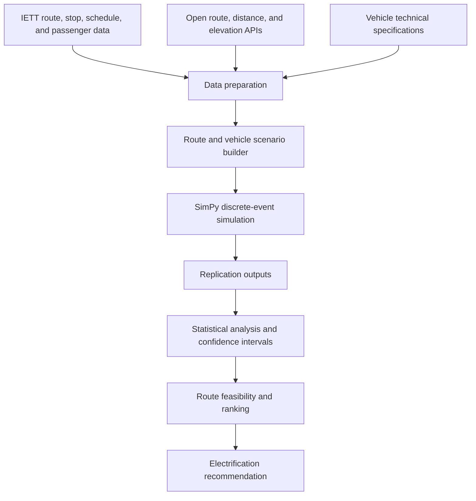

# Design Document

## Project

**Integrating Electric Buses to Istanbul Public Transportation System: Choosing the Right Routing and Number of Buses**

Repository name: `Istanbul-Electric-Bus-Optimization`

## Objective

The project designs a route-level decision-support workflow for evaluating electric bus deployment in Istanbul public transportation. The central question is which routes should be electrified first, and which bus alternatives can satisfy operational constraints while reducing emissions.

The study focuses on the Historical Peninsula as a pilot region because it is operationally dense, environmentally sensitive, and aligned with Istanbul's Low Emission Zone and decarbonization strategy.

## Stakeholders

- IETT R&D and Demand Planning teams
- Istanbul Metropolitan Municipality sustainability and transportation planning units
- Bus operations and depot planning teams
- Passengers affected by service reliability and vehicle assignment decisions

## Problem Context

Diesel buses provide flexible range and quick refueling but create direct emissions, noise, fuel cost exposure, and maintenance cost pressure. Electric buses improve environmental performance but introduce new planning constraints:

- limited battery capacity
- route distance and slope sensitivity
- passenger-load-dependent energy use
- seasonal HVAC load
- depot charging time
- fleet size and schedule feasibility
- charger infrastructure availability

A single city-wide conversion rule is not operationally realistic. Each route must be evaluated with its own demand, slope, distance, and schedule characteristics.

## Scope

### Included

- Historical Peninsula candidate routes
- Topkapi Garage and Eminonu-oriented route filtering
- BYD K8 and Karsan e-ATAK electric bus alternatives
- Karsan ATAK diesel bus baseline
- Depot charging strategy
- Summer and winter scenario comparison
- Route-level energy, emissions, battery, passenger, and schedule metrics
- Simulation verification and validation checks

### Excluded

- Real-time traffic feeds
- Dynamic charger queueing at depot
- Full lifecycle battery degradation
- Detailed capital expenditure optimization
- City-wide fleet procurement model
- Production-grade scheduling integration

## Data Inputs

The model is designed around four input groups.

### IETT Operational Data

- route codes
- ordered stop sequences
- stop coordinates
- daily number of trips
- number of buses per line
- hourly passenger boarding data
- seasonal passenger demand data

### Route Geometry Data

- route distance between stops
- road-network path estimates
- elevation values
- slope percentages by segment

These were prepared with open geographic APIs and libraries such as OSMnx, NetworkX, requests, and elevation services.

### Vehicle Data

- battery capacity
- passenger capacity
- energy consumption parameters
- diesel energy conversion assumptions
- charging behavior

### Scenario Parameters

- season
- traffic period
- passenger load distribution
- route direction
- replication seed
- simulation horizon

## System Architecture

## Simulation Model

The core model is a discrete-event simulation implemented with SimPy. Each bus follows a route made of ordered segments. The simulation updates time, passenger state, energy consumption, battery state of charge, depot charging behavior, and route completion status.

The model uses route-specific and scenario-specific parameters rather than assuming a fixed consumption value for all routes. Energy consumption is affected by:

- route distance
- road slope
- passenger load
- vehicle type
- traffic period
- season and HVAC demand

The diesel baseline is converted to comparable energy and emissions metrics using the assumptions documented in the report.

## Main Metrics

### Operational Metrics

- schedule feasibility
- trip completion
- minimum battery level before charging
- charge count
- passenger fulfillment
- vehicle utilization

### Environmental Metrics

- total energy consumption
- indirect electric-bus CO2 emissions
- diesel-bus CO2 emissions
- route-level emissions reduction

### Statistical Metrics

- sample means
- variance
- standard deviation
- 95 percent confidence intervals
- repeated simulation replications

## Decision Logic

The route selection process applies staged filtering and ranking.

1. Check whether each route can complete its daily schedule.
2. Check whether the minimum battery level remains above the safety threshold.
3. Compare total energy consumption across bus alternatives.
4. Compare electric and diesel CO2 emissions.
5. Prioritize routes with strong feasibility and high emissions reduction.
6. Treat operationally borderline routes as second-stage candidates.

## Results

The study recommends staged electrification.

### First Stage

- `93`
- `33`
- `36KE`
- `35`

These routes satisfy operational criteria and provide high CO2 reduction potential.

### Second Stage

- `336E`
- `38E`
- `33B`

These routes are promising but require more careful operational review because some scenarios or vehicle alternatives are closer to feasibility limits.

### Bus Model Recommendation

BYD K8 is favored in the study because it generally shows:

- lower average CO2 emissions than Karsan e-ATAK
- lower average energy consumption than diesel baseline
- fewer depot charging visits
- higher passenger capacity
- stronger feasibility on longer or more demanding routes

## Validation Strategy

The project applies verification and validation through:

- simplified route tests
- no-passenger scenarios
- zero-slope or low-complexity cases
- comparison of expected and observed energy behavior
- passenger-load sensitivity checks
- seasonal scenario comparison
- repeated replications with confidence intervals

These checks are intended to confirm that the model behaves logically before route ranking is interpreted.

## Repository Publication Decisions

The original source folder contained many intermediate notebook versions, copies, and personal working filenames. For publication, the repository keeps only the cleaned workflow notebooks:

- route data preparation
- all-routes simulation
- final route evaluation
- model verification
- model validation

Notebook outputs were stripped to keep the repository small and to avoid committing embedded figures, private data previews, or accidental sensitive strings.

## Reproducibility Notes

The repository is structured for reproducibility, but raw project data is not included. To rerun the full analysis, place the required input files under `data/raw/` and update notebook paths if needed.

Expected data categories:

- IETT route-stop data
- seasonal passenger distribution files
- route distance and slope files
- simulation summary outputs

## Future Improvements

- integrate real-time or historical traffic APIs
- add charger queueing and depot capacity constraints
- model battery degradation and replacement timing
- include cost per kg CO2 reduction as an optimization metric
- compare additional bus models and battery chemistries
- convert notebooks into reusable Python modules
- add a dashboard for scenario selection and route ranking

## Limitations

The model is a decision-support prototype based on academic project data and assumptions. It should not be used directly for procurement or scheduling decisions without updated operational data, stakeholder validation, and production-level engineering review.
